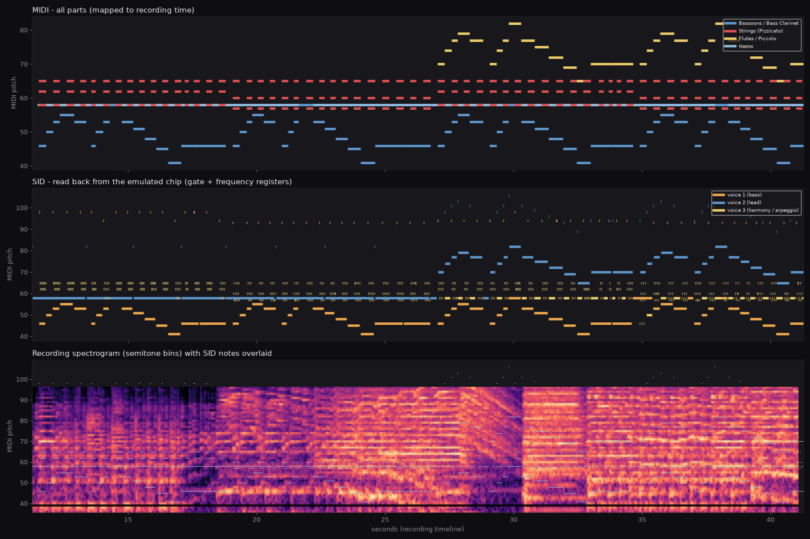

# midi2sid: orchestral MIDI → Commodore 64 SID tunes

Turns a multi-track MIDI file, optionally paired with a reference recording
(MP3/WAV), into a 3-voice SID tune for a C64 game:

| output | what it is |
|---|---|
| `NAME.sid` | PSID v2 file: plays in SIDPlay / sidplayfp / VICE `vsid` |
| `NAME.prg` | the same player + song as a raw C64 binary with load address, to link into the game |
| `NAME.asm` | ACME-syntax listing of the player and data (readable, auditable, re-assemblable) |
| `NAME.sync.json` | frame number of every bar/beat (and MIDI markers), for syncing gameplay to the music |
| `NAME.report.json` | arrangement, alignment, memory and CPU statistics |
| `NAME.wav` | preview rendered by **running the generated 6502 code** on an emulated CPU (py65) into reSID |

```bash
cd c64-sid
pip install -r requirements.txt          # + ffmpeg on PATH for --audio
python -m midi2sid song.mid                                   # MIDI timing
python -m midi2sid song.mid --audio recording.mp3             # follow the recording
python -m midi2sid.compare song.report.json recording.mp3     # sync-check mp3 + piano-roll png
python -m unittest discover -s tests                          # tests
```

## How it works

```
MIDI ──► notes per part ─┐
                          ├─► time map ─► frame-quantised notes ─► arranger ─► byte-code ─► 6502 player ─► .sid/.prg
recording ─► tuning, key, ┘   (DTW)          (50.125 / 59.826 Hz)   (3 voices)   (+ repeat      │
             tempo curve,                                                        compression)   └─► py65 + reSID ─► .wav
             loudness ───────────────────────────────► master-volume stream                           + verification
```

### 1. Timing: MIDI or recording

Without `--audio`, note times come from the MIDI tempo map. Each note start
and end is rounded to the nearest C64 frame from its absolute time (PAL
50.125 Hz, NTSC 59.826 Hz), so rounding error never accumulates: the tune
lasts exactly as long as the MIDI, ±½ frame.

With `--audio`, the recording is analysed first:

* **Tuning**: spectral-peak deviation from A440. The SID frequency table is
  rebuilt for it (e.g. +10 cents).
* **Key**: MIDI arrangements are often in a different key from the
  recording. The best transposition is chosen by DTW cost among the most
  likely keys.
* **Tempo curve**, in four steps:
  1. **Audio-to-audio DTW.** The MIDI is rendered to audio internally and
     analysed exactly like the recording, so their analysis delays cancel.
     Comparing audio with audio proved far less ambiguous on orchestral
     recordings than comparing audio with symbolic note features. A coarse
     pass at 10 fps is followed by a banded pass at 50 fps. Every step pays
     for the frames it skips, so skipping silence or mismatched material is
     never "free". Both ends are pinned to where the recording's music
     starts and stops.
  2. **Closed-loop correction.** The MIDI is re-rendered at the current
     sync and its delay against the recording is measured in 3 s windows
     (median of neighbours, low-confidence windows ignored). The map is then
     shifted by that delay, repeating until the average error is under
     20 ms. This fixes stretches where repetitive music let the DTW latch
     onto the neighbouring repetition, a beat or a bar off.
  3. **Onset snapping.** Each MIDI chord or note onset is pulled onto the
     nearest strong onset in the recording (within ±0.35 s). The correction
     is median-smoothed across neighbouring onsets, so one bad match can't
     cause a glitch.
  4. The result is a monotone MIDI-time → recording-time map that follows
     rubato, ritardandos and fermatas.
* **Recovered runs**: piano reductions drop orchestral filigree, such as
  flute runs. `recover.py` scores straight diagonal streaks in the
  recording's upper register (relative to its own running background, so
  held notes don't count) and reads each figure's notes along a monotone
  best path. A figure is only added if MIDI notes don't already trace it at
  a constant interval (unison, octave or a harmonic). The figures become an
  extra "Flute runs (from recording)" part. Their notes are slurred, so a
  run glides on one voice instead of re-attacking every 40–100 ms note.
  Use `--no-recover-runs` to turn this off.
* **Dynamics**: the recording's loudness drives the SID master volume
  (`$D418`), smoothed and hysteresis-limited to avoid the 6581 volume click.
  Use `--dynamics none` to turn this off.

On a synthetic test (the MIDI rendered with ±8% tempo drift, transposed,
detuned and with leading silence) the recovered map is within **~20 ms
(about one PAL frame)** of the truth. The report gives
`onset_score_unaligned` → `onset_score_final` so you can see how much the
alignment helped on your recording.

### 2. Arrangement: N parts → 3 voices

At every point where a note starts or a voice goes idle, the arranger scores
candidate assignments and keeps the best:

* **voice 1**: single notes, prefers the lowest line (bass)
* **voice 2**: single notes, prefers the most salient/highest line (melody)
* **voice 3**: single notes, drum hits, or a **1-frame arpeggio** through the
  remaining chord tones (the classic C64 chord trick), preferring chord tones
  not already heard in voices 1–2

**How important a note is (salience):**
* **Part role**, detected automatically (melody 1.5, bass 1.3, counter-line
  1.0, chords 0.8, drums 1.1).
* **Duration and velocity.**
* **Melodic motion**: repeated pitches and pedal tones count for less.

**Penalties** for what sounds worst on a SID:
* cutting a note that is still ringing
* re-attacking a note on another voice
* bass above melody
* arpeggios spanning more than 19 semitones
* instrument hopping

Unison doublings across parts are merged.

**The role's weight belongs to the line, not the whole hand.** In a piano
reduction the melody part also holds the harmony under its top note, and
the bass part holds chord tones above the bass. Only the top note of a
chord the melody part strikes carries the melody weight, and only the
lowest sounding note of the bass part carries the bass weight; the rest
are weighed like any chord tone. Otherwise a held inner tone of a
right-hand chord would keep a timpani figure or a bass entry off the voices.

**Slurs.** A single note of a part that starts as the part's previous note
ends and moves by a step (one or two semitones) is slurred to it: the voice
glides to the new pitch without re-attacking, as a wind or string player
would, instead of a hard restart and a fresh hammer on every eighth of the
melody. Leaps and repeated pitches keep their attacks.

**Soft entries.** With a recording, a struck note that enters while the
master volume is low (the orchestra's *p* entries) uses the sustained
variant of its instrument, with the gentler attack.

**No stale re-strikes.** A voice that frees up does not pick a chord tone
back up if that note is already sounding on another voice for a moment
(under 0.2 s) or if, for a struck sound, it has already died away: no
orchestra re-plays a chord tone a second after the chord, and such pops
between two melody notes jumble the line.

**Struck and plucked notes fade.** For piano, harp, guitar, mallets,
timpani and pizzicato, a held note's claim on its voice decays over about
0.4–0.8 s. Without this, a chord held for a bar would keep all three voices
while the left hand's moving bass line (usually what the listener follows)
was dropped. Sustained instruments (strings, winds, organ) keep their full
weight.

### 3. Instruments and envelopes

Each part gets a SID instrument, chosen from its track name ("pizz",
"bassoon", "flute", "horn" …) or its GM program. An instrument has:
* ADSR
* sustain waveform
* a **wavetable** for the first frames, e.g. a noise-burst pluck for
  pizzicato, drum pitch-drops or octave blips
* bouncing pulse-width modulation
* delayed vibrato

ADSR is then **adapted to how the part is played**:
* attack capped at ⅓ of the median note length
* staccato parts get a fast decay and release
* legato parts get enough release to bridge the hard-restart gap

Drums (MIDI channel 10) map to kick, snare, hat, cymbal and tom drum tables.

Every new note is preceded by a **2-frame hard restart** (gate off + ADSR
$00/$00), the standard fix for the SID's ADSR bug. Without it, repeated
notes swallow their attacks.

**Attack timing.** Several details keep notes from sounding late:
* **ADSR write order:** the player writes a note's AD/SR only *after* its
  gate is on, while the envelope still holds the hard restart's $00/$00.
  Writing a slower release rate while the voice is gated off lets the
  envelope's rate counter climb past the attack rate. The SID then holds the
  attack until its 15-bit counter wraps, about 33 ms: the ADSR delay bug,
  triggered by the write order. On the example this halved the measured lag
  against the recording, from 80 ms to 40 ms.
* **Anticipation:** with `--audio`, notes are triggered 40 ms ahead of the
  recording's onsets (`--anticipate-ms`). A SID attack is heard later than an
  orchestra's measured onset; this setting gave the best onset match on the
  example (0.20 → 0.46), with no measurable remaining lag.
* **Short notes** keep at least 3 audible frames: in fast passages the hard
  restart shrinks rather than cutting a note to a 1-frame chirp.
* **Clean voice use:**
  * a doubled chord tone (the same pitch struck twice at once) becomes one note;
  * a voice no longer picks up an already-sounding note for a frame or two;
  * grace notes and rolled chords written off the 16th grid join the chord
    they decorate, so the bass note under a roll keeps ringing.
* **Melody over pads:** a bass part's extra weight goes only to its lowest
  sounding note. Chord tones the same hand holds above it count like any
  chord tone, and held (sustained) notes lose importance over about 2 s.
  Otherwise a left-hand chord held for two bars keeps all three voices, and
  the melody that moves above it is never heard. On the example this halved
  the unheard melody notes (104 → 58 of 569), restoring e.g. the *Tempo I*
  melody at 1:30 and the chromatic bass descent at 1:13.
* **Recovered runs** are snapped to the half-beat grid (16ths in 6/8).
  Transcribed onsets jitter by 15–45 ms around the beat; flourishes faster
  than the grid are left as played.

Override anything per part with `--instruments overrides.json`:

```json
{
  "Flutes / Piccolo": {"preset": "lead", "ad": 34, "sr": 168, "vib_depth": 2},
  "Horns":            {"weight": 0.6},
  "Strings (Pizzicato)": {"table": [[128, 24], [64, 0]]}
}
```

(`wave`/table waveforms: 16 triangle, 32 saw, 64 pulse, 128 noise. Table notes
are relative semitones, or `"abs:N"` for an absolute note.)

### 4. Player and data

The player is written in Python against a small built-in 6502 assembler
(`asm6502.py`), so the tune can be **relocated anywhere** (`--load $C000`)
with no external toolchain. It takes about 1 KB of code and tables plus the
song data.

Song data is a compact per-voice byte-code: note, off, hard-restart, wait,
instrument, legato, arpeggio, call, jump (see `compiler.py`). Repeated
passages are compressed LZ-style into `CALL`s of earlier data. The example
compresses from 3.6 KB to 2.0 KB with MIDI timing. With recording sync,
repeats are less exact (the tempo breathes), so it compresses less.

## Sections (game cues) and score anchors

```bash
python -m midi2sid.sections examples/piano_theme.mid -a recording.mp3 \
    --edits examples/huckleberry_finn_piano.edits.json \
    --map examples/huckleberry_finn_piano.map.json \
    --anchors examples/huckleberry_finn_piano.anchors.json \
    --bars 25,51,55,73,98,103,114 -o out/huck
```

This splits a piece at bar lines into separate tunes (`out/huck_01_….sid`
… `_08_….sid`, plus `out/huck_sections.json`). It also writes
**`out/huck_all.sid`, one player holding every section as tunes 0–7**
(see *Several tunes in one player* below):
* **Every section plays its slice of one whole-piece time map**, so sections
  agree with the full-length tune and join seamlessly.
* **Each tune starts exactly on its first bar line** and lasts exactly
  until the next section's bar line, so playing section N then N+1 is
  seamless. Each tune loops on its own if left running.

The example's sections (recording times):

| # | Bars | Recording | Passage |
|---|------|-----------|---------|
| 1 | 1–24 | 0:00.2–0:23.3 | opening, flute runs, *poco a poco accel.*, descending run, fermata |
| 2 | 25–50 | 0:23.3–0:50.8 | rehearsal 4 tutti, trumpet soli, fermata swell, rehearsal 5 |
| 3 | 51–54 | 0:50.8–0:57.7 | horn soli and held horn chord |
| 4 | 55–72 | 0:57.7–1:29.0 | rehearsal 6, *pp*, ritard. to the held chord |
| 5 | 73–97 | 1:29.0–1:52.6 | rehearsal 7, *Tempo I* |
| 6 | 98–102 | 1:52.6–1:59.5 | held chord, rising arpeggio |
| 7 | 103–113 | 1:59.5–2:10.7 | tutti, to its last chord |
| 8 | 114–end | 2:10.7–2:26.4 | coda: rising bass line, closing chords |

**Score anchors** (`--anchors`) pin moments you know from the score, such as
a fermata or a *Tempo I*, to times in the recording:

```json
[{"bar": 72, "beat": 1, "recording_s": 84.65, "note": "last ritard. chord, held (fermata)"},
 {"bar": 73, "beat": 1, "recording_s": 89.07, "note": "rehearsal 7, Tempo I"}]
```

Beats count the time signature's beat unit (eighths in 6/8), starting at 1.
With a saved `--map` the map is also **straightened** between bar lines and
anchors: the alignment's within-bar wobble (up to 200 ms in this example)
is replaced by a steady tempo from one bar line to the next, so eighths
land on an even grid, like a player keeping time between the beats.

A quick way to find bar lines is a dynamic-programming fit of the
corrected MIDI's onset positions (eighths) in each bar against the
recording's attack curve, bar by bar, with each bar's length free. The
example's anchors for bars 11–20, 25–49, 73–83, 84–97 and 103–113 come
from such a fit: the recording ran a steady 50–80 ms ahead of the
feature-level alignment through most of the piece.

**Score corrections** (`--edits`). A piano reduction is not the score. Where
the full score and the recording disagree with the reduction, an edits JSON
moves, resizes, deletes or adds notes by bar and eighth, with a reason for
each change; the source MIDI is never touched (an edited copy is written
next to the output). Format and operations: `midi2sid/edits.py`. The example's
`examples/huckleberry_finn_piano.edits.json` fixes rehearsal 2 (bars 13–19,
0:11–0:18): the reduction syncopates the accented string chords onto eighth 2
and adds broken-chord filler on eighths 3, 5 and 6, while the score has the
chords on the downbeat, held a dotted quarter, over the bass line alone. The
recording attacks on the downbeat and has nothing on eighth 2. Before the
correction, the timing fit had followed the reduction's off-beat chords, so
the whole passage played an eighth note early. The same file re-enters
the horn soli of bars 51–53 as a part of its own (the reduction had stacked
the horns' chord tones on the timpani's rhythm), gives the timpani its own
part and the score's rhythm in the *pp* passage (bars 56–68, where the
reduction wrote its figure as low D eighths without the downbeat stroke),
puts the Allegro's tutti chords (bars 105–108) on the accented eighths 1
and 4 as in the score and the recording, and corrects the grace-note
figures that the recording transcription landed on bars 14–19.

`pitches` narrows a move/resize/delete to some notes of a chord (`{"part":
"Piano #2", "bars": [51, 52], "eighth": 1, "pitches": ["B2"], "delete": true}`).
An `add` to a part the MIDI lacks creates it, with the edit's `program` as
its General MIDI instrument (`{"part": "Horns", "program": 60, …}`), and an
entry with `"figure": true` replaces the transcribed grace-note figure on
that bar's downbeat (`"notes"`, last one on the beat) rather than editing
the MIDI.

**Fine-tuning one passage at a time.** Without `--map`, anchors steer the
whole-piece alignment: they are forced into it, and long hold steps let a
fermata stretch between them. But re-aligning can also move passages far
from the new anchor. To fine-tune, start from a saved map with `--map` (a
`.report.json` from an earlier run, or the
`{midi_s, recording_s, transpose, tuning_cents}` file in `examples/`). The
anchors are then **local corrections**: anchors up to 3 s apart are joined
linearly, and each correction fades out within 1 s otherwise. Nothing
outside the passage you're fixing moves. The same `--map`/`--anchors` pair
works for the single full-length tune (`python -m midi2sid … --map …`).

## Using it in the game

```
init  = load+0   ; jsr once
play  = load+3   ; jsr once per frame (raster IRQ)
frame = load+6   ; 16-bit frame counter (lo, hi), updated by play
zp    = $FB/$FC  ; temp pointer during play (--zp to move)
```

```asm
        sei
        jsr $1000            ; init music
        lda #<irq
        sta $0314
        lda #>irq
        sta $0315
        lda #$7f
        sta $dc0d            ; CIA IRQs off
        lda $dc0d
        lda #$01
        sta $d01a            ; raster IRQ on
        lda #$f8
        sta $d012
        lda $d011
        and #$7f
        sta $d011
        cli
        ...
irq     inc $d019
        jsr $1003            ; play one frame
        jmp $ea31
```

### Several tunes in one player

A game normally loads **one** player with all its music, so the ~1 KB of
player code, the frequency table and the instruments are shared. `init`
then takes the tune number in A:

```asm
        lda #3               ; tune 3 (0-based; a .sid player shows it as subtune 4)
        jsr $1000            ; init: stops the current tune, starts tune 3
```

Calling `init` again with another number switches tunes at once, e.g. on the
frame where a section ends. Play is still `jsr $1003` once per frame.

`midi2sid.sections` builds such a bundle of a piece's sections
(`--no-bundle` to skip it). For the example, all 8 sections take 7,410 bytes
together, against 17,069 bytes as 8 separate files. That's about the size of
the full-length tune (7,124 bytes), because the tunes are compressed together
and share one player. Each tune's SID register writes are identical, frame
for frame, to its separate file's.

From Python, any tunes converted with the same tuning and video standard can
be bundled, e.g. every cue of the game in one build:

```python
from midi2sid.convert import Options, convert
from midi2sid.bundle import bundle
tunes = [convert(m, "out/" + n, Options(...))["_build"] for m, n in cues]
bundle(tunes, "out/game_music", title="My Game")
```

To sync gameplay to the music, compare the frame counter at `$1006/$1007`
with the frame numbers in `NAME.sync.json` (every bar and beat). The tune
loops by default (`--no-loop` stops at the end). All three voices loop on the
same frame, so they never drift apart.

CPU cost for the example is about 2,000 cycles per frame worst case (~33
raster lines).

## Example: Grofé, *Mississippi Suite*, "Huckleberry Finn"

`examples/huckleberry_finn.mid` has 4 parts: bassoons, pizzicato strings,
flutes and horns, with up to 8 simultaneous notes.

| | MIDI timing | synced to the MP3 |
|---|---|---|
| note onsets audible on 3 voices | 85.7 % | 83.1 % |
| note-time audible | 89.5 % | 89.0 % |
| size (player + song) | 3,506 bytes | 4,740 bytes |
| 6502 verification | 565/565 attacks on the exact frame | 564/564 |

The reference MP3 is a **different performance** from the MIDI:
* it is in B♭ (the MIDI is in C) and 10 cents sharp
* it is about 12% faster
* it starts after 9.6 s of silence
* it contains material the MIDI arrangement does not have (e.g. a rising run
  around 25–30 s)

The synced build follows its key, tuning, tempo curve and dynamics. It starts
at 11.27 s into the recording, which `sync-check.mp3` (recording left, SID
right) lets you judge by ear. Where the recording and the MIDI disagree
musically, no alignment can make them agree. A MIDI transcribed from that
exact recording will sync much more tightly.



## Example: Grofé, *Mississippi Suite*, mvt. 3 (piano reduction)

`examples/piano_theme.mid` is a two-hand piano reduction: E♭, 6/8, with
tempo changes and velocity dynamics. `piano_theme_synced` follows an
orchestral recording of the movement:
* same key, +8 cents
* about 7% slower overall, with strong rubato
* onset match rises from 0.00 to 0.51
* checked by rendering the SID and measuring its delay against the
  recording in 1.5 s steps: the median offset is 60 ms (about 3 frames).
  The broad ending (five closing chords, final hit at 143.3 s) lands
  within 30 ms.

| | MIDI timing | synced to the recording |
|---|---|---|
| note onsets audible on 3 voices | 90.2 % | 90.2 % |
| size (player + song) | 7,143 bytes | 7,321 bytes |
| 6502 verification | 1125/1125 | 1116/1116 |

**Checked against the full score.** The MIDI is a piano reduction of
*Huckleberry Finn* (E♭, 6/8, *Allegro moderato scherzando*), and the
recording is the same movement. Rehearsal **2** (bar 13) is marked *poco a
poco cresc. e accel.*; there piccolo, flutes, oboes, English horn and
clarinets play a rising grace-note figure into an accented chord, one per
bar for six bars. Those are the six recovered runs. Because each figure
lands on its bar's accented chord, the converter pins the matching MIDI
chord (the right hand's 2nd eighth in bars 14–19) to the moment the figure
lands ("landing anchors": three or more regular figures, chords of three or
more notes, one-to-one). That made the piano chords and the flute runs
coincide within 17 ms through the accelerando; before, they drifted up to
0.4 s apart.

**Missing flute runs.** The piano reduction leaves out the flutes' rising
figures, about one every 0.9 s from 12.3 s. They are recovered from the
recording: D6–E♭6–E6, C♯6–F6–F♯6–G6, E♭6–F6–F♯6–G6, A♭6–A6–B♭6, B5–C6–E♭6–E6
and A♭5–A5–B♭5, plus two flourishes over the closing chords. On a synthetic
test with planted runs the detector recovers them note-exactly, and it adds
nothing to a render that has no runs. Its known limit: a run masked by a
louder held note in the same register is missed.

**Wrong-note audit.** Each MIDI note was checked against the recording's
chroma at the aligned time, looking for its pitch class being weak while a
neighbouring semitone is strong.
* No note met that test (0 of 1,467). The MIDI's notes agree with the
  recording.
* The audible differences came from the arrangement (the dropped bass
  lines described above) and from the piano preset's old one-frame
  octave-up attack. That preset now uses a same-pitch sawtooth burst.

## Verification

`convert` checks its own output. It runs the generated `.prg` on py65 and
compares every gate-on edge the player writes to `$D404/$D40B/$D412`
against the frame the compiler scheduled it for. The tests also check:
* register pitches match the notes
* compression is lossless
* branch relaxation in the assembler works
* alignment recovers a known tempo warp

The `.sid` files were also checked in sidplayfp (libsidplayfp 2.6).

## Limitations / next steps

* No filter or ring-mod/sync yet. Everything is waveform + ADSR +
  arpeggio + PWM + vibrato.
* One tune per file. Several songs could share one player (subtunes).
* The arranger is greedy, deciding at each event. A look-ahead (Viterbi)
  pass could improve voice continuity further.
* Master-volume dynamics click slightly on real 6581s. Use `--dynamics none`
  or `--model 8580` if that bothers you.
